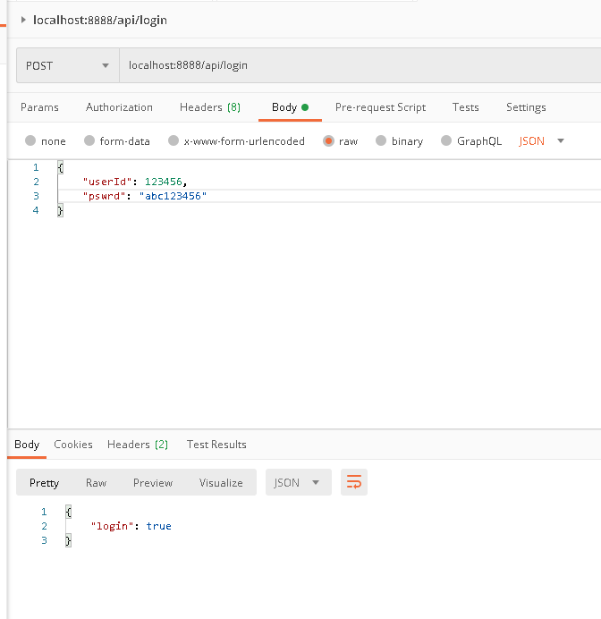
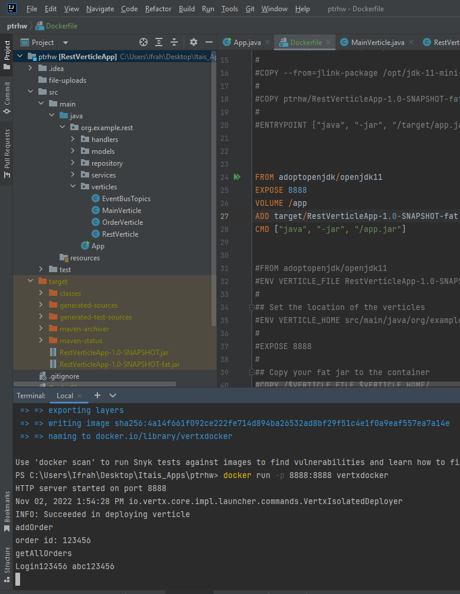

# ptrhw
Pointer Homework Assignment

pre-requisites:
- you have mvn cli installed
- you have docker desktop installed
- java 11

running the app:
- clone the project into your workspace `git clone https://github.com/itaiiiiiiiif/ptrhw.git`
- `cd prthw` 
- create the fat.jar `mvn package`
- run without Docker  ` java -jar target/RestVerticleApp-1.0-SNAPSHOT-fat.jar` OR right click and run the application
- run with Docker ` docker build -t vertxdocker .`
- `docker run -p 8888:8888 vertxdocker`

Rest Methods available (I used Postman):

POST
http://localhost:8888/api/login

example of request body (as json)
 {
    "userId" : 1234556,
    "pswrd" : "abc123456"
 }

- `http://localhost:8888`

